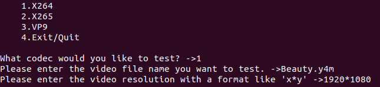
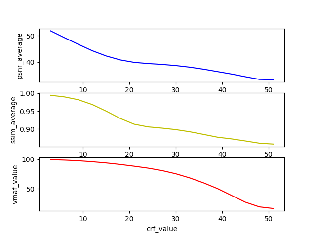
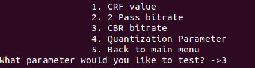
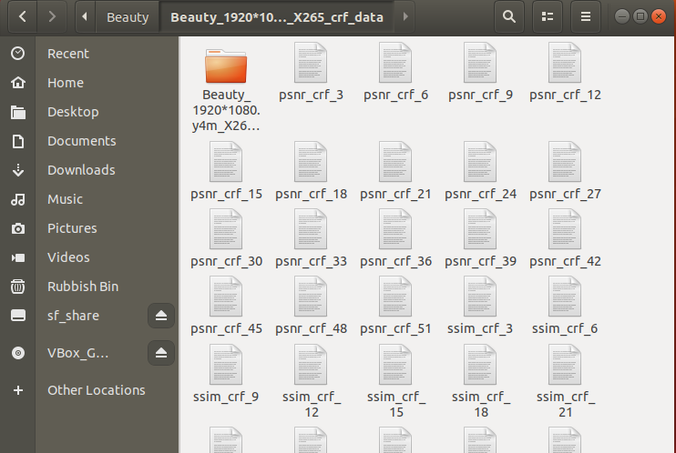
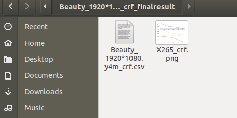
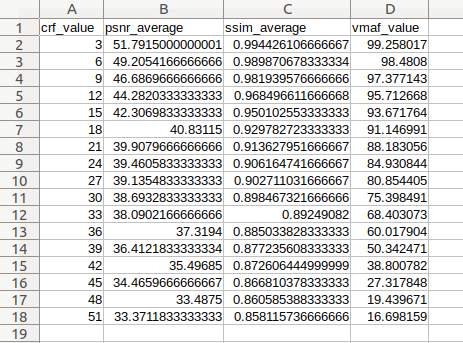
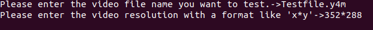
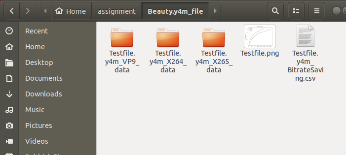
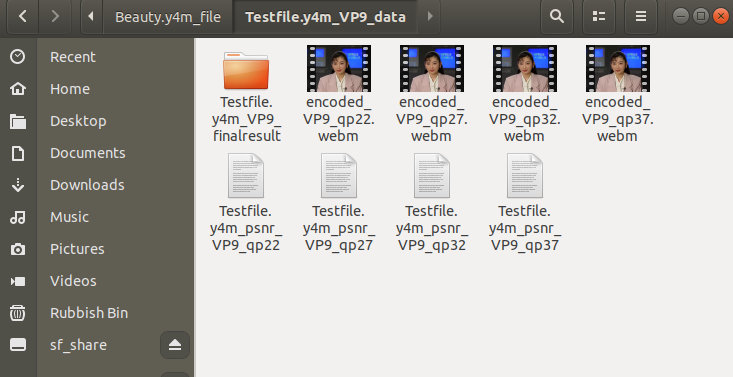

# Liyan-Zhu-IMS-automation-testbed

## Description
This is a project about codec parameter effect study and encoder performance comparison. For the first part of the project, the code is provided to complete the whole process of encoding, decoding, measurement, collecting data and plotting. In the second part of the project about encoder performance comparison, the script can be used to calculate the bitrate savings among H.264, HEVC and VP9 encoders and collect the data automatically in a csv file. Specific instructions are provided below.

## Tool Used
- The ffmpeg tool is used to encode several video sequences with tested codecs and impletement PSNR,SSIM and VMAF measurement. For the VMAF score measurement, the precompiled Linux FFmpeg tool [1] [2] is used here.
- In order to examine the accuracy of the PSNR measurement by ffmpeg tool, the psnr.cpp tool [3] is applied.
- In the second task of encoder performance comparison, we use the BD-BR calculation tool [4] which is used as **Bitrate.py** in the project.

## Instruction
In this section, we give guidance on how to use the code to realize automation.
### Codec Parameter Effect Study
- For the first step, please download **Parameter.py、ffmpeg tool and model folder** as preparation. Please put all the document including your tested videos under the same path.
- Run the **Parameter.py** and follow the instructions to provide information about your tested codec and video contents. As for the video resolution, please enter format like "1920*1080". 

- After enter details about tested codec and video sequences, you will be asked which parameter you would like to test. Please enter your choice with a number. 
- The calculation results will be stored in a folder. Open the folder you will find that all the data including PSNR and SSIM results is in the folder and there is another folder to be open.
- Open the final folder and the final result and graphs are stored in this folder.

### Encoder Performance Comparison
- Please download **Performance.py、Bitrate.py and ffmpeg tool** as the first step. Please put all the document including your tested videos under the same path.
- Run the **Performance.py** and enter details about your tested videos.  

- The final results including bitrate savings and graphs are stored in the folder, and you will find another folder.
- Open the folder, all the calculation data is stored here. 

## Reference
[1] "Precompiled Linux FFmpeg tool", [online] Available at: http://www.ee.ucl.ac.uk/~iandreop/ffmpeg_static_with_VMAF.zip  
[2] Netflix, “Perceptual video quality assessment based on multi-method fusion”, [online] Available at: https://github.com/Netflix/vmaf 
[3] "psnr.cpp tool", [online] Available at: http://www.ee.ucl.ac.uk/~iandreop/psnr_seq.zip 
[4] GitHub, “Bjontegaard_metric”, [online] Available at: https://github.com/Anserw/Bjontegaard_metric 
